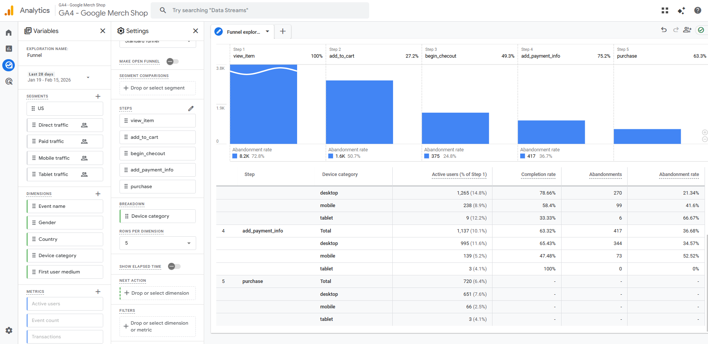

# GA4 E-commerce Funnel Audit
GA4 Funnel Exploration project with drop-off analysis, measurement audit, and UX recommendations.

## Table of Contents
- Project Overview
- Funnel Setup
- Drop-off Analysis
- Measurement Audit
- Recommendations
- Conclusion

## Project Overview
This project analyzes the e‑commerce conversion journey using Google Analytics 4 (GA4) Funnel Exploration.  
The goal was to understand where users drop off in the purchase process, compare performance across devices, and identify potential measurement inconsistencies in the tracking setup.

The analysis is based on the GA4 Google Merch Shop demo property, using the last 28 days of data.  
The funnel includes the key e‑commerce events:

- view_item  
- add_to_cart  
- begin_checkout  
- add_payment_info  
- purchase  

The project includes:

- Funnel setup documentation  
- Drop‑off analysis  
- Device‑level performance comparison  
- Measurement audit  
- UX and tracking recommendations  

---

## Funnel Setup
The funnel was built using GA4’s Funnel Exploration tool to analyze the full e‑commerce journey from product view to purchase.

### Funnel steps included:
1. **view_item** – Product detail page viewed  
2. **add_to_cart** – Item added to cart  
3. **begin_checkout** – Checkout process started  
4. **add_payment_info** – Payment information entered  
5. **purchase** – Transaction completed  

### Settings used:
- **Open funnel:** Enabled  
- **Breakdown:** Device category  
- **Date range:** Last 28 days  
- **Visualization:** Standard funnel  

### Screenshot of the funnel:

  

---

## Drop-off Analysis
The funnel shows significant user drop-offs across the e-commerce journey.  
The analysis below highlights where users abandon the process and what these patterns may indicate.

### 1. view_item → add_to_cart (72.8% drop-off)
Only 27.2% of users who view a product add it to their cart.

**Possible reasons:**
- Lack of persuasive elements (reviews, pricing clarity, shipping info)
- Weak or poorly placed CTAs
- Slow mobile performance
- Low purchase intent browsing

**Device insights:**
- Desktop add-to-cart rate: 29.24%
- Mobile add-to-cart rate: 20.43%

Mobile users convert significantly worse, suggesting UX friction on smaller screens.

---

### 2. add_to_cart → begin_checkout (50.7% drop-off)
Half of the users who add an item to the cart do not start checkout.

**Possible reasons:**
- Unexpected shipping costs
- No guest checkout option
- Cluttered cart layout
- Weak trust signals

---

### 3. begin_checkout → add_payment_info (24.8% drop-off)
One in four users abandon during checkout initiation.

**Possible reasons:**
- Too many form fields
- Missing autofill support
- Poor mobile usability
- Limited payment options

---

### 4. add_payment_info → purchase (36.7% drop-off)
A large portion of users who enter payment info do not complete the purchase.

**Possible reasons:**
- Payment errors or declined cards
- Lack of trust at the final step
- Late disclosure of shipping cost
- Price comparison behavior

---

### Summary
The highest friction points occur at:
- **Product → Cart**
- **Payment Info → Purchase**

Mobile users consistently underperform compared to desktop, indicating a need for mobile-first UX improvements.

---

## Measurement Audit
A funnel is only reliable if the underlying tracking is accurate.  
The audit verifies whether all e‑commerce events fire correctly and consistently.

### Event Coverage Checklist

| Event | Expected | Status |
|-------|----------|--------|
| view_item | Fires on product detail page | ✔️ Present |
| add_to_cart | Fires when user adds item to cart | ✔️ Present |
| begin_checkout | Fires when checkout starts | ✔️ Present |
| add_payment_info | Fires when payment info is entered | ✔️ Present |
| purchase | Fires on successful transaction | ✔️ Present |

All core e‑commerce events are firing correctly.

---

### Parameter Audit

| Parameter | Why it matters | Expected | Status |
|-----------|----------------|----------|--------|
| item_id | Identifies product | Required | ✔️ Present |
| item_name | Product name | Required | ✔️ Present |
| currency | Needed for revenue | Required | ✔️ Present |
| value | Total value of event | Required | ✔️ Present |
| items[] array | Contains product details | Required | ✔️ Present |

The GA4 demo store includes all required parameters, making it suitable for analysis.

---

### Potential Measurement Risks
Common real‑world issues that can distort funnel accuracy:

- Duplicate events  
- Missing value or currency  
- purchase firing without items[]  
- begin_checkout firing too early/late  
- add_payment_info firing inconsistently  
- Missing enhanced measurement on mobile  

---

### Conclusion of Audit
The GA4 demo store provides a clean and reliable dataset.  
All required events and parameters are present, enabling accurate funnel analysis.

---

## Recommendations

### UX Recommendations
1. **Improve mobile product page usability**  
   Increase CTA size, spacing, and reduce scroll depth.

2. **Show shipping costs earlier**  
   Display estimated shipping on product and cart pages.

3. **Simplify checkout flow**  
   Reduce form fields, enable autofill, allow guest checkout.

4. **Strengthen trust signals**  
   Add security badges, return policy highlights, and payment logos.

5. **Optimize payment step**  
   Offer multiple payment methods and improve error handling.

---

### Tracking Recommendations
1. Validate event timing (begin_checkout, add_payment_info).  
2. Monitor duplicate events.  
3. Ensure value and currency parameters are always present.  
4. Track micro‑steps (view_cart, select_shipping, payment_error).  
5. Implement enhanced measurement on mobile.

---

## Conclusion
This project demonstrates how GA4 Funnel Exploration can be used to analyze user behavior across the e‑commerce purchase journey.  
By identifying major drop‑off points, comparing device performance, and auditing event tracking quality, we gain a clear understanding of where users struggle and how the experience can be improved.

The analysis highlights:
- Significant friction between product view and cart  
- Mobile users performing worse than desktop  
- A major drop‑off at the payment stage  
- The importance of accurate event tracking  

This project reflects a complete end‑to‑end analytics workflow: from data exploration to actionable insights.

